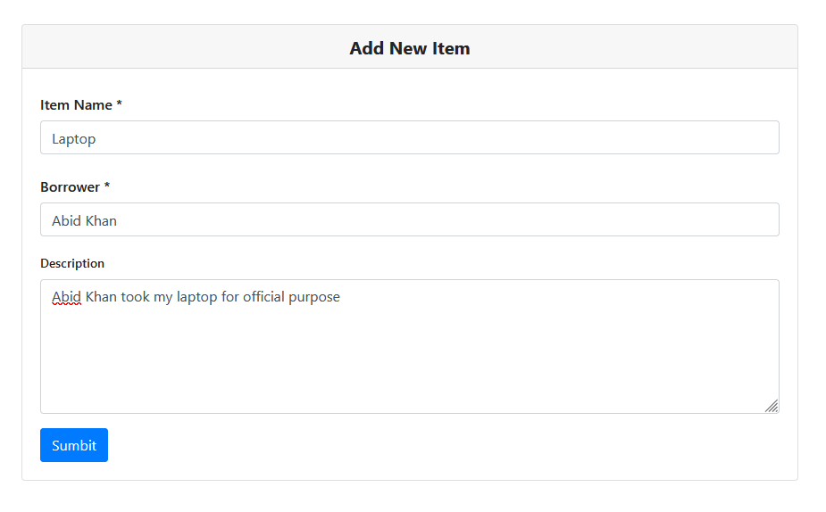
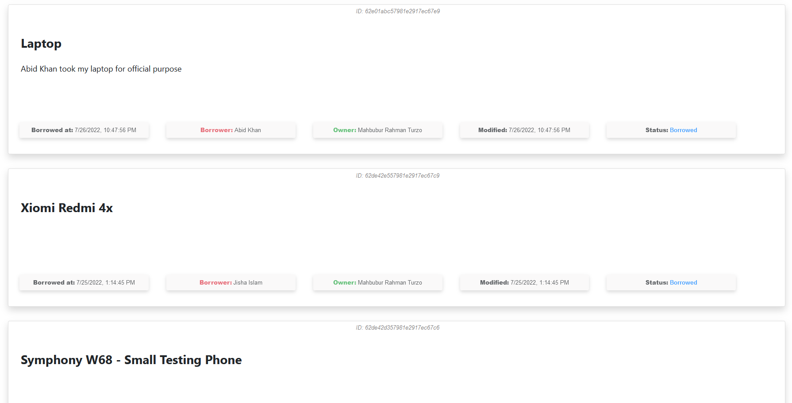
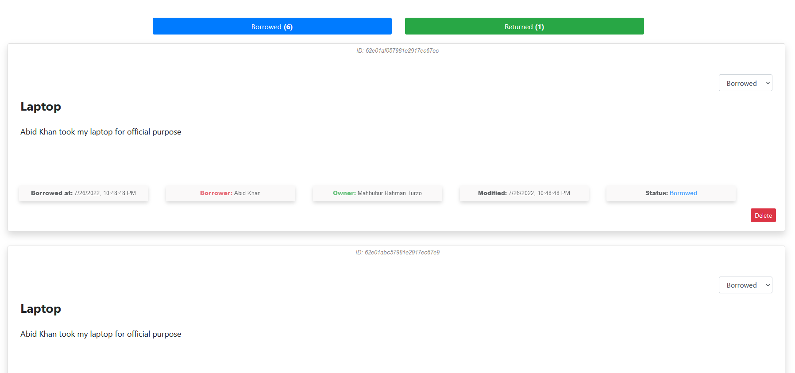
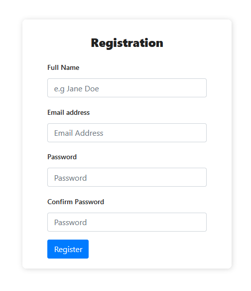
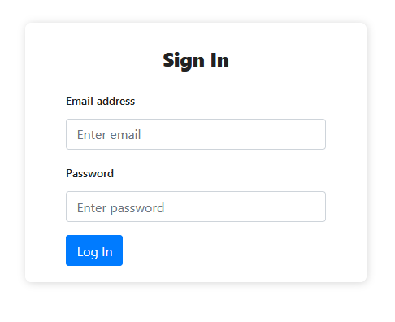
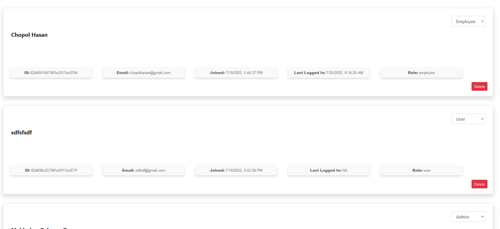

# Asset Tracker Application

Developed By : [Mahbubur Rahman Turzo](https://github.com/Turzoxpress)

## Frontend : **ReactJS, Bootstrap** ([Source Code](https://github.com/Turzoxpress/asset-tracker-react-frontend))

## Backend : **NodeJS, Express** ([Source Code](https://github.com/Turzoxpress/asset-tracker-node-backend))

## Database : **MongoDB**













## How to start ?

```
git clone https://github.com/Turzoxpress/asset-tracker-react-frontend

npm i

npm start
```

## Contributing

Pull requests are welcome. For major changes, please open an issue first to discuss what you would like to change.

## License

[MIT](https://choosealicense.com/licenses/mit/)
